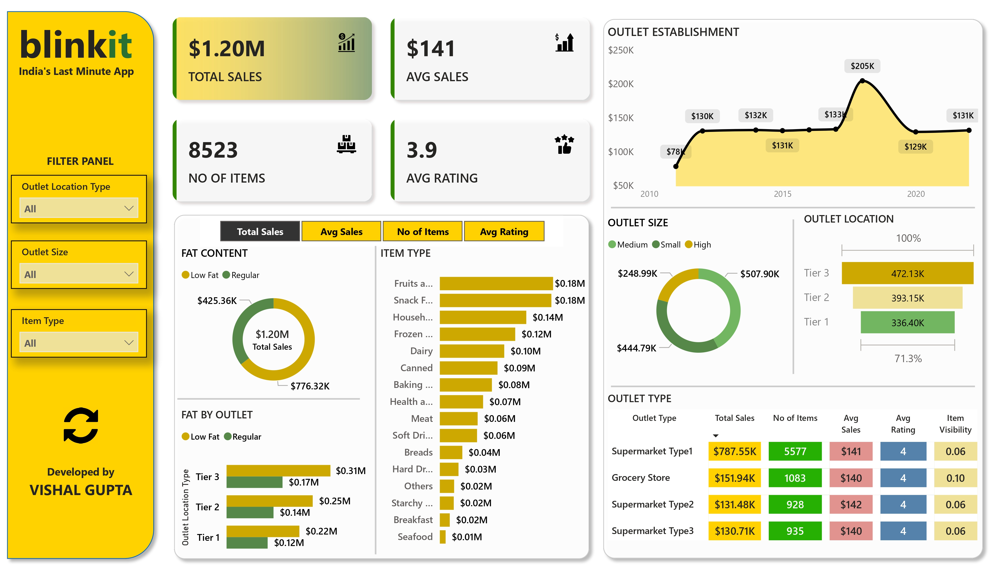

# Blinkit Sales Insights Dashboard 📊

This project focuses on analyzing Blinkit's sales data to generate actionable insights aimed at optimizing operations and increasing revenue. It features a Power BI dashboard with interactive visualizations that help stakeholders make data-driven decisions.

## 🔍 Project Overview

The **Blinkit Sales Insights** dashboard provides a comprehensive view of key sales metrics, regional performance, and product category trends. With clear visual storytelling and interactive elements, it empowers users to:

- Monitor key performance indicators (KPIs)
- Identify top-performing product categories
- Understand regional sales dynamics

## ⚙️ Tools & Technologies

- **Power BI** – For building interactive visualizations and dashboards
- **Excel/CSV** – As the data source (assumed)
- **Data Cleaning & Transformation** – Performed within Power BI’s Power Query Editor

## 📌 Key Features

- **Dynamic KPIs** – Track revenue, number of orders, and average order value
- **Top Categories Analysis** – Identify which product lines drive the most revenue
- **Regional Trends** – Visualize sales performance across various zones
- **User-Friendly Layout** – Simple yet insightful design tailored for decision-makers

## 🖼️ Dashboard Preview

 

## 🚀 Getting Started

To explore the dashboard:

1. Clone or download this repository
2. Open the `.pbix` file using **Power BI Desktop**
3. Click through the tabs and filters to explore insights

> _Note: Ensure you have Power BI Desktop installed before opening the file._

## 📈 Insights Uncovered

- Identified high-performing product categories to prioritize
- Spotted underperforming regions for targeted marketing
- Enabled leadership to quickly assess key metrics and trends

## 🙌 Acknowledgements

Made with ❤️ by Vishal - https://github.com/heyvishal08

---

